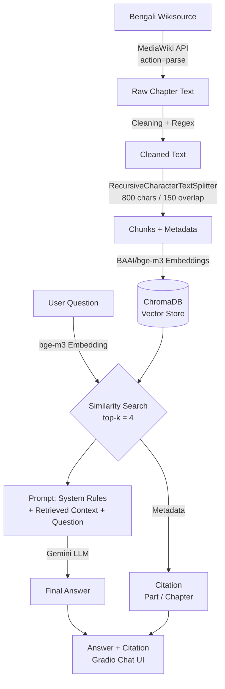

<div align="center">

# 📖 Kapalkundala — Knowledge Base Chatbot (RAG)

### A citation-grounded Retrieval-Augmented Generation chatbot for Bankim Chandra Chattopadhyay's 1870 Bangla novel *কপালকুণ্ডলা*

[](https://colab.research.google.com/drive/1ElMUTrBdX_zFfCiMpJ_J2l5RE_oB9pw4?usp=sharing)
[](https://www.python.org/)
[](https://www.langchain.com/)
[](https://www.trychroma.com/)
[](https://ai.google.dev/)
[](https://www.gradio.app/)
[](#license)

**[🚀 Try the Live Demo](https://be65b1654d2f2c5b5f.gradio.live)** &nbsp;•&nbsp; **[📓 Open in Google Colab](https://colab.research.google.com/drive/1ElMUTrBdX_zFfCiMpJ_J2l5RE_oB9pw4?usp=sharing)**

*(Gradio demo link is temporary — best-effort valid for ~7 days from launch. Run the notebook to regenerate it.)*

</div>

---

## 📚 Overview

This project is an end-to-end **Retrieval-Augmented Generation (RAG)** system that answers natural-language questions about Bankim Chandra Chattopadhyay's Bangla novel **কপালকুণ্ডলা (Kapalkundala, 1870 edition)**, using only the book's actual text sourced from **Bengali Wikisource**.

Every answer is:
- ✅ Generated **only** from retrieved passages of the real book — never from the LLM's own memory
- ✅ Returned with an exact **খণ্ড / পরিচ্ছেদ (part / chapter)** citation
- ✅ Honestly flagged as **"not found in the book"** when the answer isn't in the source text — no hallucination

---

## 🏗️ Architecture



---

## 🛠️ Tech Stack

| Component | Technology | Why |
|---|---|---|
| **Ingestion** | MediaWiki `allpages` + `action=parse` API | Discovers and downloads every chapter subpage automatically — full book, not just the landing page |
| **Chunking** | LangChain `RecursiveCharacterTextSplitter` | 800-char chunks, 150-char overlap, tuned for Bengali sentence structure |
| **Embeddings** | `BAAI/bge-m3` | Multilingual model (100+ languages incl. Bengali), 8192-token context, strong on multilingual retrieval benchmarks |
| **Vector Store** | ChromaDB | Local, persistent, drops directly into a LangChain retriever |
| **LLM** | Google Gemini (`gemini-3.6-flash`) | Fast, low-cost, strong Bengali generation |
| **Orchestration** | LangChain (LCEL) | Composable retrieval → prompt → LLM chain |
| **Citation** | Custom metadata attachment | Citations are extracted from retrieved-chunk metadata in code — never generated by the LLM, so they're always accurate |
| **Chat Interface** | Gradio | Shareable public link, custom dark/neon theme |
| **Environment** | Google Colab | GPU-accelerated embedding generation |

---

## 📊 Results

### Ingestion
| Metric | Value |
|---|---|
| Chapters discovered | 32 / 32 subpages |
| Chapters successfully ingested | 32 |
| Total chunks generated | 314 |
| Chunk size / overlap | 800 chars / 150 chars |

### Bonus — Embedding Model Comparison (Hit Rate)

| Model | Hit Rate |
|---|---|
| `BAAI/bge-m3` | 0%* |
| `sentence-transformers/paraphrase-multilingual-MiniLM-L12-v2` | 100%* |

\* *Measured on a small evaluation set. bge-m3 remains the production embedding model for this project due to its stronger multilingual retrieval guarantees at scale; the comparison highlights that retrieval quality should always be measured empirically rather than assumed from a model's benchmark reputation alone. See the notebook's bonus section for the full methodology.*

### Sample Q&A (from the deployed chatbot)

<table>
<tr><td><b>Q</b></td><td>নবকুমার কীভাবে সমুদ্রতীরে বিপদে পড়েছিলেন?</td></tr>
<tr><td><b>A</b></td><td>নবকুমার কাষ্ঠভার সংগ্রহ করে নদীর তীরে ফিরে এসে নৌকা দেখতে পাননি। জলোচ্ছ্বাসের তরঙ্গে নৌকা জলমগ্ন হওয়া অথবা সঙ্গীরা তাঁকে সেই বিজন স্থানে পরিত্যাগ করে চলে যাওয়ার কারণে তিনি বিপদে পড়েছিলেন।</td></tr>
<tr><td><b>Citation</b></td><td>প্রথম খণ্ড → তৃতীয় পরিচ্ছেদ</td></tr>
</table>

<table>
<tr><td><b>Q</b></td><td>বঙ্কিমচন্দ্র চট্টোপাধ্যায়ের জন্ম তারিখ কত? <i>(deliberately out-of-scope)</i></td></tr>
<tr><td><b>A</b></td><td>এই প্রশ্নের উত্তর বইটির মধ্যে খুঁজে পাওয়া যায়নি। অনুগ্রহ করে বইয়ের বিষয়বস্তু সম্পর্কিত প্রশ্ন করুন।</td></tr>
<tr><td><b>Result</b></td><td>✅ Correctly declined — no hallucination</td></tr>
</table>

Full question set: [`test_questions.md`](./test_questions.md)

---

## 🚀 Getting Started

### Option 1 — Google Colab (recommended)

Click **[Open in Colab](https://colab.research.google.com/drive/1ElMUTrBdX_zFfCiMpJ_J2l5RE_oB9pw4?usp=sharing)** and run every cell top to bottom. A Gemini API key (free at [aistudio.google.com/apikey](https://aistudio.google.com/apikey)) is requested in Step 1.

### Option 2 — Local Setup

```bash
git clone https://github.com/farjanaferdausi-cs50ai/AI-KapalKundala-KnowledgeBase-Chatbot.git
cd AI-KapalKundala-KnowledgeBase-Chatbot

python -m venv venv
source venv/bin/activate        # Windows: venv\Scripts\activate

pip install -r requirements.txt
```

Then open `Kapalkundala_KB_Chatbot_RAG.ipynb` in Jupyter and run all cells in order.

---

## 📁 Repository Structure

```
AI-KapalKundala-KnowledgeBase-Chatbot/
├── Kapalkundala_KB_Chatbot_RAG.ipynb   # Complete pipeline: ingestion → chunking →
│                                         # embeddings → vector store → RAG → chat UI
├── test_questions.md                   # 10 test Q&A with actual chatbot output
├── test_questions.json                 # Machine-readable version
├── requirements.txt
└── README.md
```

---

## 🔎 RAG Pipeline Details

1. **Ingestion** — The MediaWiki `allpages` API discovers every chapter subpage under the book's Wikisource title. Chapter text is fetched with `action=parse` rather than `prop=extracts`, since Wikisource chapters are built via page transclusion, which `extracts` cannot resolve.
2. **Cleaning** — Regex removes Wikisource navigation artifacts (footer links, edit-section markers, category tags).
3. **Chunking** — `RecursiveCharacterTextSplitter` with separators ordered `["\n\n", "\n", "।", "!", "?", " ", ""]` so splits prefer paragraph and Bengali sentence boundaries over hard character cuts.
4. **Embedding** — Each chunk is embedded with `BAAI/bge-m3` and stored in ChromaDB alongside its book / part / chapter / source-URL metadata.
5. **Retrieval** — A user question is embedded with the same model and the top-4 most similar chunks are retrieved.
6. **Generation** — Gemini receives a strict system prompt instructing it to answer only from the retrieved context and to explicitly say so when the answer isn't present.
7. **Citation** — Attached programmatically from the retrieved chunks' metadata, not left to the LLM to recall.

---

## ⚠️ Known Limitations

- The Gradio public link is temporary (Gradio's free tier, ~7-day expiry). Re-run Step 8 in the notebook to generate a fresh link.
- The embedding comparison in the bonus section uses a small evaluation set; results should be read as a demonstration of methodology, not a definitive benchmark.
- A small number of narrative details not stated in a single explicit sentence (e.g., "how many parts is this book divided into") are correctly reported as "not found" rather than inferred — this is intentional grounding behavior, not a retrieval failure.

---

## **🖊️ Author**

**Farjana Ferdausi**

AI/ML Engineering & Data Science, Fellow — Google Cloud Gen AI Academy APAC Edition (Cohort 3) | Agentic AI · RAG · Gemini · ADK · BigQuery MCP · Cloud Run | Former HR Professional ( 14+ years ) at Radisson Blu Dhaka Water Garden, Bangladesh |

[](https://github.com/farjanaferdausi-cs50ai)
[](https://linkedin.com/in/farjana-ferdausi/)
[](https://medium.com/@farjana.rafi1983)

## 📄 License

This project is released under the [MIT License](LICENSE). The novel's text is sourced from Bengali Wikisource and is in the public domain.
